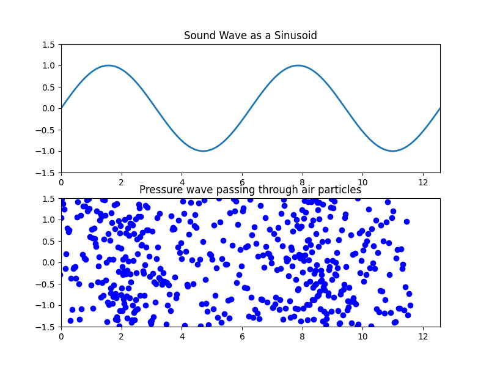
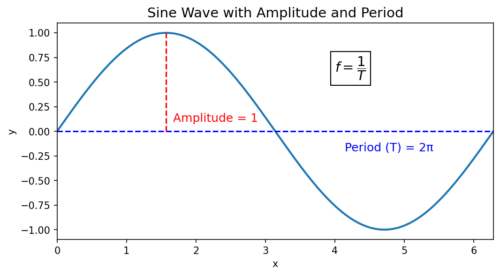
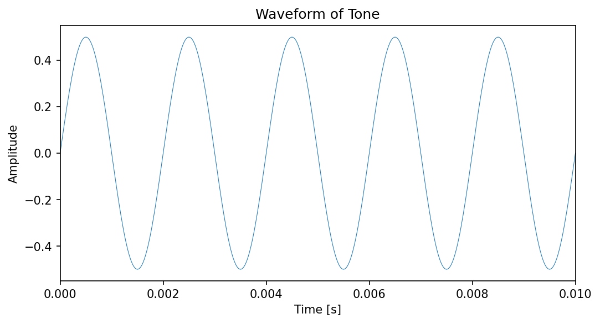

# What is audio?
What humans perceive as "sounds" are actually [pressure changes in the air over time](https://en.wikipedia.org/wiki/Sound_pressure#Sound_pressure_level).  

A local pocket of high air pressure (aka compression) is created when something physically pushes air molecules together. Those air molecules have to come from somewhere, so this also creates local pockets of low pressure somewhere nearby. Air molecules in the high pressure area push outward into any low pressure areas around them, while air molecules around any low pressure area push inward to fill the vaccuum.  As the nearby air moves around to equalize these pressure differentials, it creates new pressure differentials with the air on the opposite side of the original disturbance, which in turn try to equalize, create new differentials, etc.  This ultimately creates pockets of high and low pressure that propogate outward from the original point in a shape that we call "waves" (these are exactly the same fluid dynamics that cause ripples when you drop a pebble in water). When you "hear" a sound, that is your brain interpreting these pressure waves.  See [this page](https://nsinstruments.com/principles/approaches.html) for a much deeper exploration. 

Waves have a *period* (the distance over which they complete one full cycle) and an *amplitude* (how high the wave goes).  They also have a *frequency* (how quickly the wave oscillates), which is by definition just the inverse of the period

 

Because audio is a *time varying* signal (i.e. the x-axis is time), the period of an audio wave is measured in seconds and the frequency is measured in Hertz (number of cycles per second). The typical range of human hearing is roughly 20 Hz - 20,000 Hz (or 20 kHz), though the upper range tends to decrease to around 8 - 12 kHz in our 50's and 60's.

The amplitude of a sound wave corresponds to the *volume* or *intensity* of the sound, and the y-axis is literally a measure of the air pressure at a given point in space over a period of time. 

??? note "scientific units of pressure" 
	If you remember your chemistry, the ideal gas law states that PV = nRT, or pressure = number of particles x some constant x temperature / volume.  Temperature is defined as the average kinetic energy (kg x m^2 / s^2) per particle of a gas.  If you rearrange the ideal gas law, you'll find that the units of pressure simplify to "Newtons per square meter" (also known as "Pascals"), where a Newton is a unit of force (with units of kg x m / s^2). 

	"Force per square meter" aligns with most people's intuitive understanding of pressure - you can think of it as "the amount of force exerted by a volume of gas on a container trying to hold that volume of gas".

While pressure can be measured "objectively" as Newtons per square meter, it turns out this is not how we actually talk about sound volume.  Instead, we talk about sound volume in units of [decibels (dB)](https://en.wikipedia.org/wiki/Decibel), which is a *relative* unit of measure expressing the ratio of two values on a logarithmic scale.

??? note "some math behind decibels" 
	In the case of sound waves, pressure is a root-power quantity, meaning the square of the sound wave pressure is proportional to power.  This means if you have two time-varying pressure signals (e.g. two sound waves) X and Y, you can calculate the root mean square of each (i.e. the average value of the square of the pressure measurements of each signal over a given time period), and the dB value relating the two is proportional to the log_10 of the ratio of the RMS values - specifically, X would be considered 20 * log_10(RMS(X)/RMS(Y)) dB louder than Y.  

	Colloquially you might say that if X is "20 dB louder" than Y, that means X is "100 times louder" (more technically, it means the amount of power in X is 100 times more than the amount of power in Y)

That's a lot of big words to make the simple point that *dB is a relative unit of measure*.  When people talk about a sound being "90 dB", what they mean is "90 dB louder than a particular reference sound."  In audio, the reference sound is basically always 20 micropascals (μPa), which is generally considered "the quietest sound a human can hear" and would correspond with a volume of "0 dB" in common usage.

??? note "sound pressure level reference"
	When we say "the reference sound is 20 micropascals", what we mean is "the reference sound is a wave for which the RMS is 20 micropascals".  So it's a statement about the *pressure differential created by the wave*, not a statement about the ambient air pressure or the specific pressure at the peak or trough of the reference wave.  Note that the ambient air pressure at sea level is approximately 1 Atmosphere, or 101,325 Pascals.  So the pressure differential human ears are able to detect is really, really small relative to the ambient pressure around us. 

??? note "other meanings of dB"
	Because dB is a generic measure of the ratio of two signals, it can occasionally be an overloaded term in the audio space; for example, the primary metric used in audio separation and enhancement tasks is Signal To Noise Ratio (SNR), which is also measured in dB (or dB gain) with the ground truth "noise" as the reference signal (as opposed to the 20 μPa reference sound used for sound volume). 

The amplitude of an air pressure wave changes over both time and distance; as you get farther away from the source of the wave the the amplitude shrinks following the [inverse square law](https://en.wikipedia.org/wiki/Inverse-square_law) (because the energy of the wave is being dissapated over a larger and larger area the farther out you go), and as time passess the amplitude will also decrease as energy is lost through friction and absorbtion.  For simplicity, some audio analysis techniques assume that audio sources and receivers remain fixed in space, and conduct analysis on a small enough time scale that amplitude decay is negligible.  But in the real world sound wave propogation is a complex and dynamic system.

??? note "a brief discussion of temperature"
	If you are anything like me, you may be bothered by the fact that both temperature and altitude change the ambient air pressure, so you can't actually talk about "sound pressure" without taking into account air temperature and altitude at the time and location the sound wave is propogated.  The way to resolve this is to recognize that what characterizes a sound wave is not the absolute pressure, but rather the pressure *differential*. Lower absolute ambient pressure does in fact reduce the pressure differential of a sound wave (and therefore the perceived volume) given the same initial impulse, but it affects all sound waves in roughly the same way, so it's not something that tends to come up in most technical audio discussions.

## How do waves combine together to create sound?
Here's an example of what a single 500 Hz wave sounds like:

<audio controls src="assets/single_500hz_wave.wav"></audio>

Of course in the real world audio is not just one wave at a time, it's many overlapping waves happening at the same time. When two waves are propogating through the same medium at the same time, the amplitudes add together and the resulting signal (called the "interference") is a "complex tone" made up of more than one frequency. Here's an example of two different frequency waves played at the same time:

[Audio] audio of a sin wave at 12 KhZ plus a sin wave at 7 KhZ[/Audio]
[Image] image of a the combination of a 12 KhZ signals + a 7 KhZ signal [/Image]

The human ear is very good at interpreting an interference pattern and understanding which frequencies are present.  There's a surprising amount about the ear that we still don't understand, but [roughly speaking](https://nsinstruments.com/principles/approaches.html) we have thousands of hair-like cells that each oscillate with different frequency ranges.  We'll talk below about the Fourier Transform, which is a mathematical technique that lets us identify the individual frequencies present in a complex tone.

Humans interpret some combinations of frequencies as "sounding better" together than others. While some aesthetic judgement is certainly cultural and individual preference, much of it is deeply rooted in the mathematical relationship between the frequencies.  For example, an "octave" in music is an interval between two notes where the higher note has double the frequency of the lower note, and the C major chord has a frequency ratio of 4:5:6.  

[Audio] audio of 3 sin waves playing a c major chord [/Audio]
[Image] image of the above sin waves together [/Image]

## Phase
Human ears can identify (and often have preferences for) frequencies that are integer multiples, share common divisors, or are otherwise mathematically related to each other.  However, if you naively play these frequencies together, it can sound wrong in a way that is *extremely noticeable* to human ears:

[Audio] audio of a sin wave at 12 KhZ plus a sin wave at 9 KhZ[/Audio]
[Image] image of a the combination of a 12 KhZ signals + a 9 KhZ signal [/Image]

[Audio] audio of a sin wave at 12 KhZ plus a sin wave at 8 KhZ[/Audio]
[Image] image of a the combination of a 12 KhZ signals + a 8 KhZ signal [/Image]

What's happening here is that precisely because of the mathematical relationships of the waves, the peaks are lining up with each other in some regular periodic way, creating a "strobing" effect in the interference pattern where the pressure amplitude of the sound wave is much higher where the waves intersect than where one peaks without the other. 

However, consider what might happen if one of these waves was "shifted over" by a bit in time.  You'd still be hearing the same two frequencies, but the peaks would no longer line up, which would remove the unpleasant artifact you hear in the original.

[Audio] audio of a sin wave at 12 KhZ plus that same frequency phase shifted 48 degrees[/Audio]
[Image] image of the above waves in isolation and the interference pattern from combining them [/Image]

We call the amount of "shift" in a wave the *phase*.  Specifically, because we model all waves as sign waves, and each point in a sin wave cycle corresponds to an angle of a circle, phase is measured in degrees.  The phase difference between two waves can be defined as a difference in their initial angles around the circle. A difference of 180° means the waves are completely out of phase, or inverted relative to one another.  

??? note "phase change as a periodic signal" 
	Much like dB, phase is not a fact about an individual wave in isolation, but rather about the relationship between two different waves (or an individual wave relative to a particular point in time).  If you compare two waves of different frequencies, the phase difference between them will be constantly changing over time.  The phase difference itself will be periodic, and for signals that are small integer ratios of each other, the phase difference might be periodic with a frequency above 20 Hz, which is within the range of human hearing! This is that low buzzing you're hearing when you listen to overlapping tones with e.g. 30 Hz phase shift [Audio] Audio of two tones with a periodic phase shift of 30 Hz [/Audio] 

Shifting the phase of interfering waves can have a dramatic impact on the phase and amplitude of the resulting sound, which in turn can dramatically impact human perception. If you play the exact same sound at a 180 degree phase shift with itself, the interference will cancel out the original sound and anyone listening would hear silence (this is how sound cancelling headphones work).  If you play the exact same sound to each ear, but one of them slightly phase shifted, the human brain will perceive a "binaural beat" [TODO: link] auditory illusion. If you play all frequencies at the same time with the same amplitude (aka white noise), shifting the phase over time can lead to different "texture" of the sound.

??? note "combining sin waves" 
	When you combine two sin waves of the same frequency but different phase and amplitude, the resulting signal will be a sin wave with the exact same frequency, but a different phase and amplitude (both of which depend on the relative phase of the waves you combined).  This is [the basis](https://nsinstruments.com/principles/linear.html) for a huge number of audio effects, like phasers and filtering.

[Audio] audio of a complex combination of sin waves at differnet frequencies, amplitudes, and phase shifts [/Audio]
[Image] image of the above waves in isolation and the interference pattern from combining them [/Image]

[Audio] audio of the same frequency waves as above, but at differnet amplitudes and phase shifts [/Audio]
[Image] image of the above waves in isolation and the interference pattern from combining them [/Image]

That's it.  That's all sound is. **All sound is fully specified by the frequency, amplitude, and phase of the pressure waves propogating through a given point in space over time.**  I know these toy examples don't sound like "real audio" - we'll talk about that more below - but it's important to understand that "sound" is just your brain interpretting extremely complex and time-varying combinations of the above.

??? note "combining independent vs. correlated signals" 
	If you combine multiple independent audio sources playing the same "note" (e.g. a chorus of singers, or multiple instruments playing the same part in an orchestra) statistics can give you a [rule of thumb](https://nsinstruments.com/principles/linear.html) for the average expected increase in amplitude based on phased interference; this is why two people singing together isn't twice as loud as a single person.  However, if you instead have multiple microphones recording the same audio source and mix them together, the phases of the various partials are no longer independent and can result in dramatically different changes in volume.

## Fundamental Frequency and Timbre

In the real world, you're usually hearing thousands of overlapping frequency waves with different levels of energy that your brain is automatically synthesizing into the experience of "hearing."  The human brain tends to group certain combinations of frequencies together as a single "sound" even though they are actually made up of complex combinations of frequencies.  The specific combination of frequencies is called the "timbre" of a sound, and this is why two different instruments playing the "same frequency" of note sound different to human ears.  

When people talk about the "frequency" of a note played by an instrument (or sung by a human), they're talking about the "fundamental frequency" (often referred to as f0) which is the lowest (and often perceived as the "loudest") frequency present in that complex tone.

## Frequency Bands
Frequency is an analog value, meaning it is continuous and can be specified to arbitrary precision.  However, in the real world there's a limit to the precision with which we can measure and produce specific frequencies, and the frequency of a signal can shift over time.  Given that nearby frequencies tend to behave similarly, it is often useful to think in terms of frequency ranges, which we generically refer to as "bands" (e.g. "5 kHz - 6 kHz"). 

There is no single correct way to bucket frequency ranges together, but there are conventions depending on the context. Frequency tends to behaves in logarithmic ways (i.e. the ratio of two frequencies is generally more important than the absolute difference between them), so frequency band conventions are often simillarly logarithmic (e.g. 50 Hz - 100 Hz might be one band, while 4 kHz - 8 kHz might be another band).

## Reflection
When sound propogates through an environment, the air pressure waves impact and bounce off of solid objects in the environment (walls, trees, the ground, other people, etc). The amount, direction, and diffuse / specular nature of reflection depends on the characteristics of the surface impacted - the smoothness / roughness, the elasticity of the material, the geometry of the object, etc. These characteristics are frequency dependent, meaning sound waves will reflect off of materials differently depending on the frequency. These reflections dramatically impact the character and quality of a sound, and are what makes the same audio sound different depending on the enviornment you're listening in.

??? note "high amplitude reflection" 
	At high amplitudes, a material's reflection can become amplitude dependent as well when the sound wave starts affecting the properties of the reflecting material itself.

[Image] A top-down view of a square room with an audio source with arrows showing how audio might reflect off nearby walls in a specular way.  Image is labeled as "low frequency spectral reflection" [/Image]

[Image] A top-down view of the same square room as above with an audio source with arrows showing how audio might reflect off nearby walls in a diffuse way.  Image is labeled as "high frequency diffuse reflection" [/Image]

## Reverberation & Room Impulse Response

A listener in an enclosed room will hear not just the original sound, but also the reflections (and reflections of reflections, etc) off of surfaces in the room. This leads to the same signal arriving at a given point in space at a very slight delay and from different directions and with diminishing amplitudes.  The repetition of the same signal at a very slight delay is referred to as "reverberation," and reverberation caused by the reflections of sound off of walls is called the "room impulse response."  Note that the room impulse response depends on the location of both the audio source and the listener; different positional combination in the same room will have a different room impulse response.

??? note "reverberation vs. echo"
	The distinction between reverberation and echo is largely arbitrary; reverberation is conventionally defined as "repeating signal at < 50 - 100ms delay" while echo is defined as "repeated signal at > 50 - 100ms delay." However, the human brain tends to interpret echo as "repetition of the original sound" and reverb as "part of the original sound"

Reverberation is itself often frequency dependent, and you can characterize reverb as "for a given initial impulse signal, how much of the energy present in each frequency band of the original signal will be repeated back at what time delay?"  

In principle you could try to describe some function estimating the amount of energy from the original signal that will arrive at the source for each frequency band over time. In practice, reverb is sometimes characterized by a single number describing how long it takes for a 60 dB reduction in energy in a given frequency band (or sometimes just a single number for the whole 20 Hz -20 kHz band). In cases where more precision is needed, we typically bucket time blocks together much like we bucket frequency bands together and record energy decay for each time bucket x frequency band combination.  For example, we might say "for the 50 Hz - 100 Hz frequency band, room reflections will result in 80% of the energy in the initial signal being present for the first 10ms, 70% for the next 10ms, 65% for the next 10ms, etc."  By convention, these time buckets are generally linear rather than logarithmic, and are typically specified as 10ms chunks.

Note the structure of this 2-dimensional characterization of reverberation - there is a different "percentage of energy" value for each frequency band for each time period.  To visualize this data you can create an image where the y axis is frequency band, the x-axis is time, and the color of each pixel (or box) corresponds with the energy level.  This concept of visualizing quantized 2 dimensional time x frequency data as an image is important, and will come up again when we describe how audio is digitally represented as spectrograms.

??? note "RIR relationship to spectrograms" 
	In fact, the "energy per frequency band over time" that you would use to describe a room impulse response is literally the same thing as a spectrogram, so there's nothing stopping you from treaing an RIM as audio and "playing" it out loud. The results sound kind of cool, and will give you a good idea of how the RIM will affect any audio it's applied against [Audio] example audio of a room impulse response [/Audio]

Reverb and room impulse responses can be estimated from microphone recordings of real audio samples, or they can be simulated in software. Once a reverberation profile has been obtained, it can be applied to an audio signal as a processing technique (often used to add reverb to a digital signal often makes it feel more "real"), which we'll talk about in more detail when we get to the spectrogram discussion below 

??? note "analogizing reverb simulation to 3D rendering"
	Simulating reverb is essentially the same thing as a 3D graphics rendering engine.  You set up some 3D model and specify the characteristic behavior of all of the surfaces, then you "raycast" audio out from a point source and calculate what shows up at the targt recording point.

[Audio] example audio of TTS or music output without reverb and with reverb to show the difference[/Audio]

## Head related transfer function

Reverberation doesn't just come from reflection off of surfaces.  It also comes from individual components, materials, or objects that are part of or in contact with the audio source (e.g. the neck of a guitar, or the body of a piano, or the through muscles of a singer, etc).  Simillarly, reverberation happens when elements connected to the listner (the housing of the microphone, the tissue and bones of an individual's facial structure, etc.) In particular, every human has their own unique [head related transfer function](https://en.wikipedia.org/wiki/Head-related_transfer_function) that describes how a signal will propogate through their own particular anatomy.  My understanding is its a little unclear how unique the HRTF actually is (and how important a custom HRTF is for a good listening experience for extreme audiophiles), but nonetheless its important to note that your own body affects the characteristics of the sound you actually experience.

??? note "HRTF is what makes your voice sound different on recordings" 
	This is why your voice sound different to you than it does on a recording - when you speak, your vocal chords are vibrating to produce waves in the air in your vocal tract that everyone else hears (and get recorded by any relevant equipment).  However, they're also producing resonant vibration and reverberation in your own skeletal and muscular structure, which your ears are picking up in addition to the frequencies propogating over the air.  You are literally hearing something different than everyone else when you speak

## Localization, Multichannel & Spatial Audio

The reason most animals have two ears rather than one is that it allows for sound source localization.  Because the ears are placed some set distance apart, the brain can use the differences between the signals received by each ear to infer which direction a sound is coming from (simillar to depth perception in the visual domain).

??? note "spatialization degrees of freedom" 
	While time delay is the primary signal used for spatial localization of audio, there are actually too many degrees of freedom to accurately do 3-dimensional localization with only 2 signal receivers; a sound from directly above you would have the same relative delay to both your ears as a sound directly below you.  Your brain uses other signals (such as the head related transfer function discussed below) to disambiguate directionality in 3 dimensions.

Because of this, digital media replayed from a single speaker tends to lack a depth quality present in real audio, particularly in video where the user "expects" audio from different sources on screen to come from different directions. To improve the user experience, digital recordings might have more than one "channel" of audio. Typical audio formats include "mono" (one channel), "stereo" (two channels, one left and one right), and "spatial" (a variety of public and proprietary formats).  Most playback devices (laptops, tablets, headphones, etc.) have at least a left and right speaker to support stereo output. Spatial audio formats allow for speakers placed in different locations to allow audio to "sound like" it's coming from a particular place, which can significantly enhance the listening experience for some content, but is generally not well supported in most consumer content ecosystems today (mostly home theaters and movie theaters).  

??? note "spatial audio in consumer devices"
	There has been work over the last few years to move toward broader adoption of spatial audio playback for consumer headphones.  This requires both the broad adoption of spatial audio formats on the recording side (or ML models to "upsample" mono/stereo content to spatial), as well as technological progress on the playback side (primarily head tracking and cheap and easy measurement of individual head related transfer function & individual room impulse response) to allow the headphones to dynamically alter the audio playback for each earbud. Both Android and iOS have some level of spatial audio support, but it needs to be manually enabled, and the content availability is still not super broad.  I have no idea how good the spatial audio is when enabled on either platform. 

	If you've heard of "5.1 surround sound", that's a Dolby proprietary standard that has 5 predefined directional channels for a known physical configuration of 5 speakers (front left, front right, front center, back left, back right) and one subwoofer channel (specifically for low frequency sounds).  Simillarly, "7.1 surround sound" has 7 predeifined directional channels and one subwoofer.  Dolby Atmos is the name of their proprietary spatial audio format that allows for arbitrary placement of audio sources in 3D space; Atmos format audio can then be "rendered" to a specific set of speakers with a given spatial layout (which could be 5.1 or 7.1, or could be your own custom speaker setup).

Recording stereo audio requires multiple microphones with a known spatial relationship (aka a "microphone array"), and most consumer recording devices (e.g. phones) come with a mic array of between 2-8 mics.  [TODO: verify this is correct] For simplicity, we will mostly talk about mono channel audio going forward, but in principle most approaches, techniques, and concerns generalize to multichannel audio.

## Directional Beamforming

Directional beamforming is a processing technique that allows an audio signal recorded on two or more mics to be decomposed based on the direction the sound came from.  Essentially this relies on the fact that the delay between when mic 1 and mic 2 hear the same sound is a function of the angle of the sound source relative to the microphones and the distance of the mics from each other.  For only two microphones a known distance apart, a given audio delay is enough to specify a parabolic cone [TODO: name for this?] along which the sound must have originated; by adding a third mic you can in theory specify a specific point (including distance) of the orignal audio source (so long as that point is not co-planar with the 3 mics).

In practice what this means is that you can take audio recorded on a microphone array with known dimensions and filter it (i.e. delay one and add them together) so that sounds not coming from one particular direction cancel each other out, leaving you only the sounds coming from a particular direction.  This is useful when you want to do things like "record audio coming from right in front of a camera while supressing any audio coming from the ambient environment," or "separate speech coming from one speaker from speech coming from a second speaker," both of which are potentially relevant for audio AI models. 

??? note "separating information streams in audio" 
	In the context of this document, we mention beamforming mostly to make the point that it is possible in some contexts to isolate different information streams within the same audio recording.  This opens up some possibilities for novel audio tokenization / preprocessing that could improve model performance that are discussed below

